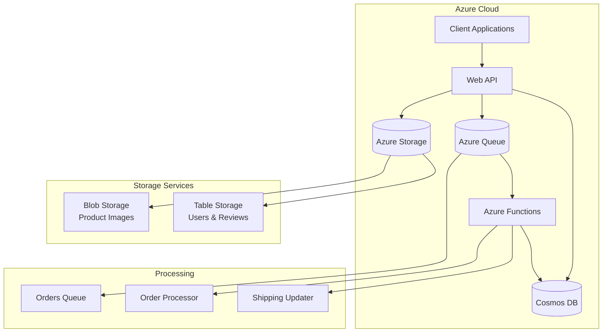

# 🏪 WidgetStore - Cloud Native E-commerce Solution

[](https://dotnet.microsoft.com/en-us/)
[](https://azure.microsoft.com/)
[](https://docs.microsoft.com/en-us/dotnet/csharp/)
[](https://azure.microsoft.com/services/cosmos-db/)

A cloud-native e-commerce platform built with .NET 8 and Azure services, designed for high scalability and performance.

## 🏗️ Architecture



## 🚀 Features

- **Scalable Architecture**
  - Azure Cosmos DB for product & order data
  - Azure Table Storage for user management
  - Azure Blob Storage for product images
  - Azure Functions for background processing

- **Security**
  - JWT Authentication
  - HTTPS enforcement
  - Secure key management

- **Design Patterns**
  - CQRS pattern
  - Repository pattern
  - N-tier architecture

## 🛠️ Technical Stack

### Backend
- .NET 8 Web API
- Azure Functions (.NET 8 Isolated)
- Azure Cosmos DB (Serverless)
- Azure Storage (Blobs, Tables, Queues)
- Azure Application Insights

### Infrastructure
- Azure App Service
- Bicep for IaC
- GitHub Actions for CI/CD

## 📋 Prerequisites

- .NET 8.0 SDK
- Azure Subscription
- Azure CLI
- Cosmos DB Emulator
- Azure Storage Emulator
- Azurite
- Visual Studio 2022

## 🔧 Local Development

```powershell
# Clone repository
git clone https://github.com/TommyTides/Widget-Store.git

# Restore dependencies
dotnet restore

# Run the API
Set both WidgetStore.API and WidgetStore.Functions as startup projects
```

```powershell
# Run the Functions (in another terminal)
cd WidgetStore.Functions
func start
```

## 🌩️ Cloud Deployment

```powershell
# Deploy infrastructure
./deploy.ps1 -resourceGroupName "your-group" -tenantId "your-tenant"
```

## 📊 Project Structure

```
WidgetStore/
├── WidgetStore.API           # Web API
├── WidgetStore.Core         # Domain models & interfaces
├── WidgetStore.Functions    # Azure Functions
├── WidgetStore.Infrastructure# Data access & services
└── WidgetStore.Shared      # Common utilities
```

## 🔍 Key Design Decisions

- **Single Cosmos Container Strategy**: Optimized for cost and performance
- **Serverless Architecture**: Auto-scaling and pay-per-use
- **Event-Driven Processing**: Using Azure Queue Storage
- **CQRS Implementation**: Separate read and write operations

## 📈 Performance Features

- Cosmos DB partition optimization
- Azure CDN-ready blob storage
- Queue-based order processing
- Scalable compute resources